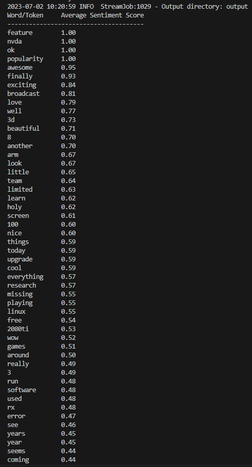

# Hadoop-MapReduce-Sentiment-Analysis

Sentiment analysis, also known as opinion mining, plays a significant role in Natural Language Processing (NLP) by extracting and understanding sentiments expressed in textual data. When dealing with vast amounts of data, Hadoop MapReduce provides an efficient and scalable framework for processing and analyzing sentiment data. This project utilizes Hadoop MapReduce to determine the average sentiment of words in a given dataset. The entire workflow is encapsulated in a Docker Image ensuring easier reproducibility
 and deployment across various environments.

## Introduction

This project focuses on analyzing sentiment in Twitter data. Each line of the dataset represents a tweet with a sentiment label indicating whether the sentiment in the tweet is positive (1), neutral (0), or negative (-1).

## MapReduce Workflow

The project follows a MapReduce workflow, where data is processed in parallel across a distributed cluster. Here's an overview of the MapReduce steps:

### Mapper

The mapper processes the input data by tokenizing each tweet and extracting sentiment scores for individual words. It removes punctuation and stopwords, and emits key-value pairs of word-sentiment pairs. The output is then sent to the Hadoop Distributed File System (HDFS) for further processing.

### Reducer

The reducer receives the word-sentiment pairs from the mapper and calculates the average sentiment score for each word. It filters out words with a count below a certain threshold (e.g., 15) to ensure statistical significance. The results are sorted in descending order based on the average sentiment score and displayed in a tabular format.

The resulting sentiment analysis provides insights into the emotional tone associated with different words in the dataset.

## Setup and Execution

For detailed instructions on setting up and running the Docker image for this project, please refer to the [SETUP.md](SETUP.md) file.

## Future Work

This project lays the foundation for more advanced NLP tasks, such as classification, in a highly distributed and scalable manner. Future work could involve extending the MapReduce framework to handle more complex sentiment analysis tasks or integrating additional machine learning techniques to enhance the accuracy of sentiment prediction.

Feel free to explore and contribute to this project!

